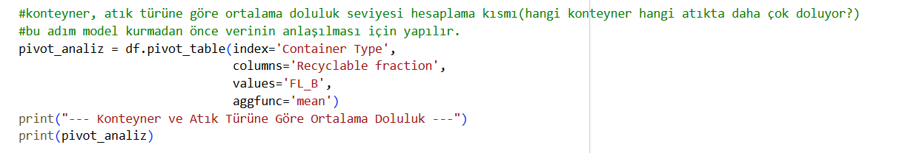
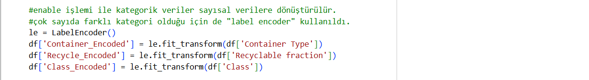
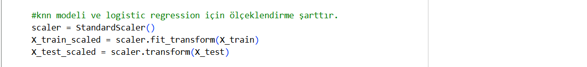
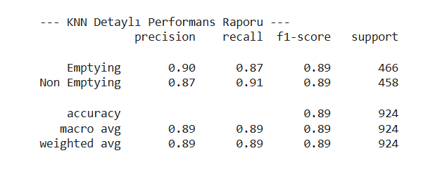
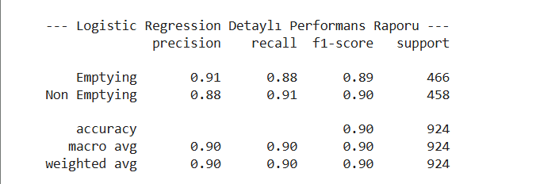
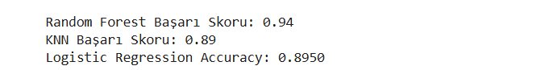
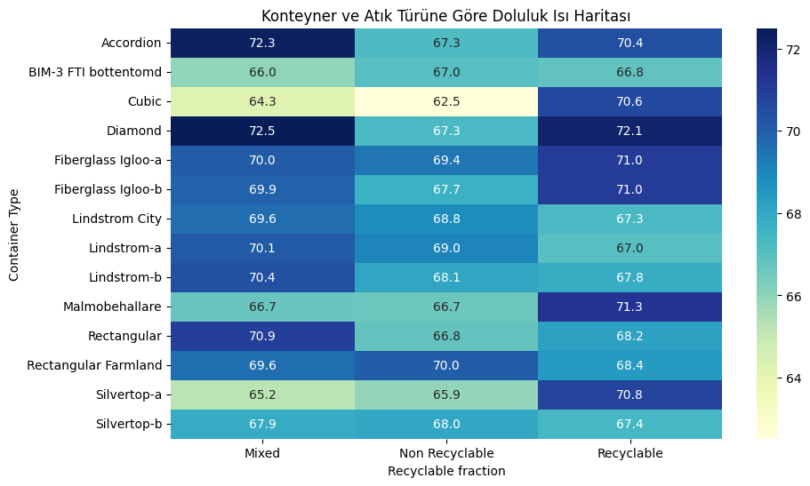
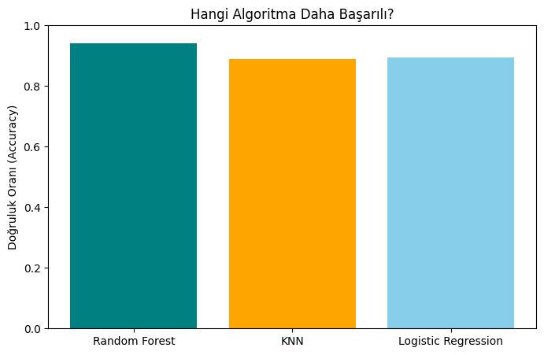
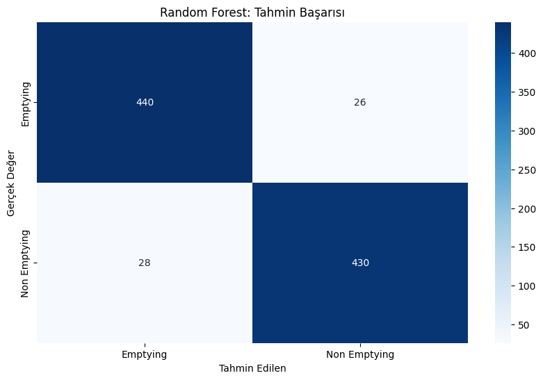
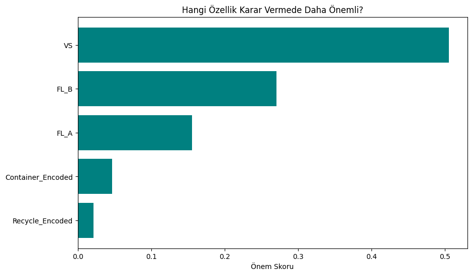

# Smart Bin Occupancy & Emptying Prediction

Bu proje, akıllı şehir teknolojileri kapsamında çöp konteynerlerinin doluluk oranlarını analiz etmek ve boşaltma kararlarını optimize etmek için hazırlanmış bir makine öğrenmesi çalışmasıdır. Hedefimiz, sensör verilerini kullanarak verimli bir atık toplama yönetimi sağlamaktır.

---

## Proje Amacı

Akıllı atık yönetimi, şehirlerdeki operasyonel maliyetleri düşürmek ve çevre kirliliğini önlemek için kritik öneme sahiptir. Bu proje ile amaçlananlar:

1. Konteyner doluluk seviyelerini etkileyen faktörleri analiz etmek.
2. Pivot Tablo analizi ile konteyner tipi ve atık türü arasındaki doluluk ilişkisini ortaya koymak.
3. Farklı makine öğrenmesi algoritmalarıyla (RF ve KNN) "Boşaltma Kararı" tahmini yapmak.

---

## Veri Seti

Veri seti, akıllı çöp kutularından alınan sensör verilerini ve konteyner özelliklerini içermektedir.

Kolonlar:

- Class: Boşaltma durumu (Emptying / Non-Emptying) — Hedef Değişken (y)
- FL_B: Güncel doluluk oranı (B Sensörü)
- FL_A: Güncel doluluk oranı (A Sensörü)
- VS: Hacimsel sensör verisi
- FL_B_3: 3 saat önceki doluluk verisi
- FL_B_12: 12 saat önceki doluluk verisi
- Container Type: Konteynerin yapısal tipi (Cubic, Diamond, vb.)
- Recyclable fraction: Atık türü (Mixed, Recyclable, vb.)

---

## Sonuç ve Model Karşılaştırması
Bu çalışmada, konteynerlerin boşaltılma durumunu tahmin etmek için üç farklı supervised (denetimli) makine öğrenimi modeli kullanılmıştır:

- **Random Forest Classifier**  
- **K-Nearest Neighbors (KNN)**
- **Logistic Regression**  

Her model aynı eğitim/test veri seti üzerinde değerlendirilmiş ve doğruluk (accuracy) skorları karşılaştırılmıştır.

---

## Veri Ön İşleme ve Teknik Açıklamalar

**1. Pivot Tablo Analizi(Kritik Adım)**  
Veri setinde onlarca farklı konteyner tipi bulunuyor. Büyük bir listeye düz bir şekilde bakarak; "Hangi konteyner daha hızlı doluyor?" veya "Geri dönüştürülebilir atıklar konteyner kapasitesini nasıl etkiliyor?" gibi sorulara cevap vermek imkansızdır.Bu nedenle modelin tahmin edeceği 'Class' (Boşaltma Kararı) değişkeninin arkasındaki ana sebepler (Konteyner Tipi ve Atık Türü arasındaki ilişki) matematiksel olarak özetlenmiş oldu. Pivot tablo kullanılmasaydı, elimizdeki veriler sadece birbirinden kopuk sayılar yığını olarak kalacaktı.

**2. Label Encoding (Etiket Kodlama)**  
Metin tabanlı veriler, bilgisayarın anlayabileceği sayısal değerlere dönüştürülmüştür. Çok sayıda farklı kategori olduğu için de Label Encoder tercih edilmiştir.

**3. StandardScaler (Ölçeklendirme)**  
KNN ve Logistic Regression algoritmaları sayısal büyüklüklere karşı duyarlıdır. Bu nedenle büyük sayısal değerlerin (örn: 90 olan FL_B) küçük değerli etiketleri (örn: 1 olan kategori) domine etmemesi amacıyla tüm özellikler aynı ölçeğe getirilmiştir. Bu adım modellerin adil bir şekilde eğitilmesi için zorunludur.

---

## Model Performanslarının Yorumlanması

**K-Nearest Neighbors (KNN)**  
%89 başarı oranıyla güçlü bir performans sergilemiştir. Mesafe tabanlı olduğu için scaling işlemi başarısını doğrudan artırmıştır.

**Random Forest Classifier**
%94 doğruluk oranıyla projenin en başarılı modeli olmuştur.Doğrusal olmayan karmaşık sensör ilişkilerini ağaç yapısı sayesinde en iyi o yakalamıştır.

**Logistic Regression**
%87 başarı oranıyla temel bir sınıflandırma performansı sunmuştur. Daha basit ve hızlı bir model olmasına rağmen karmaşık verilerde RF'in gerisinde kalmıştır.

---

## Genel Değerlendirme

**Model Başarısı**  
Test sonuçlarına göre Random Forest Classifier modeli, %94 gibi yüksek bir doğruluk oranıyla projenin en güvenilir modeli olmuştur. Bu durum, sensör verilerindeki karmaşık ve doğrusal olmayan ilişkilerin ağaç tabanlı modeller tarafından daha iyi yakalandığını kanıtlamaktadır.

**Veri Analizi (Pivot) Önemi**  
Yapılan pivot tablo analizleri, her konteyner tipinin her atık türünde aynı hızda dolmadığını göstermiştir. Örneğin, belirli konteyner tiplerinin "Mixed" atık türünde %70'in üzerinde doluluk ortalamasına ulaştığı gözlemlenmiştir.

**Özelliklerin Etkisi (Feature Importance)**  
Modelin karar mekanizması incelendiğinde, güncel doluluk sensörü verisinin yanında, geçmişe dönük verilerin de tahmin başarısında kritik rol oynadığı görülmüştür. Bu da sistemin sadece anlık değil, zamansal değişimleri de takip ederek daha tutarlı kararlar verdiğini gösterir.

---

## Grafikler

### Konteyner ve Atık Türü İlişkisi (Pivot Isı Haritası)

-Bu grafik, yaptığımız Pivot analizinin görsel bir özetidir. Renkler koyulaştıkça o konteyner ve atık tipinin doluluk oranının arttığını görüyoruz.

### Model Başarı Karşılaştırması

-Random Forest ve KNN modellerinin doğruluk skorlarını yan yana koyarak hangisinin daha "akıllı" olduğunu karşılaştırdık.

### Random Forest - Karmaşıklık Matrisi (Confusion Matrix)

-Bu matris, modelin nerede hata yaptığını tane tane gösterir. Sol üst ve sağ alt köşedeki büyük sayılar, modelin "Boşaltılmalı" dediği ve gerçekten boşaltılması gereken veya "Boş" dediği ve gerçekten boş olan kutuları temsil eder.

### Özellik Önem Sırası (Feature Importance)

- Modelin karar verirken hangi sensör verisine (özelliğe) daha çok güvendiğini gösteren grafiktir.

